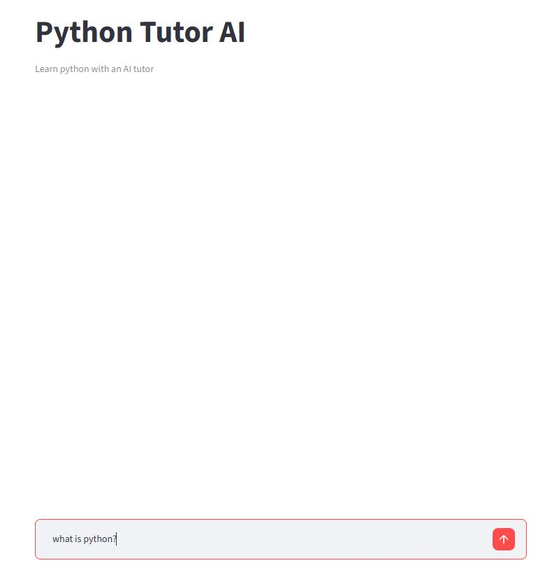
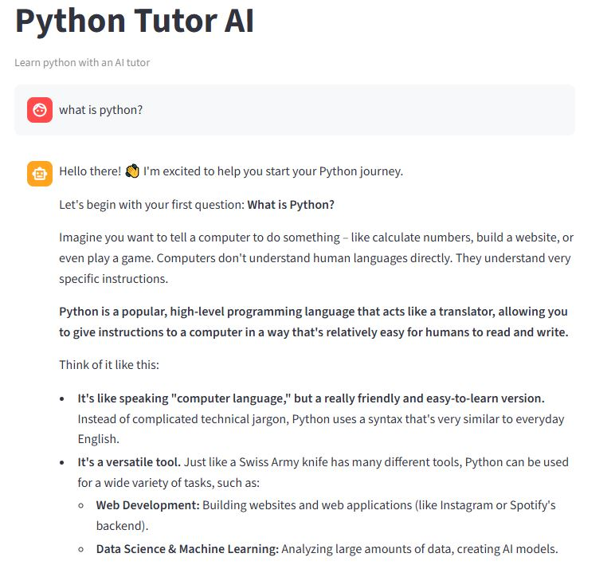
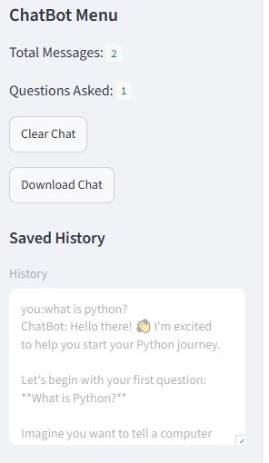

# Python Tutor AI

An AI-powered Python Tutor built with Streamlit and Google Gemini API. The application helps beginners learn Python by explaining concepts, debugging code, providing hints, and answering programming questions.

## Live Demo
https://python-tutor-ai-ayk74tdnjpz56md6ihh5mr.streamlit.app/

## Features

* Interactive AI chat interface
* Python learning assistance
* Code explanation and debugging help
* Chat history saving
* Download chat history
* Sidebar dashboard
* Message statistics
* Clean Streamlit user interface

## Technologies Used

* Python
* Streamlit
* Google Gemini API

## Concepts Used

* Functions
* Lists
* Dictionaries
* File Handling
* Exception Handling
* Environment Variables
* Session State
* API Integration

## Installation

Install required packages:

```bash
pip install -r requirements.txt
```

## Setup

Create a Gemini API key and set it as an environment variable:

```bash
Gemini_API_Key=your_api_key_here
```

## Run the Application

```bash
streamlit run app.py
```

## Project Structure

```text
Python-Tutor-AI/
│
├── app.py
├── requirements.txt
└── README.md
```

## 📸 Screenshots

### Home Page


### Ask a Python Question



### AI Response



### Chat History




## Author

Eman Fatima
